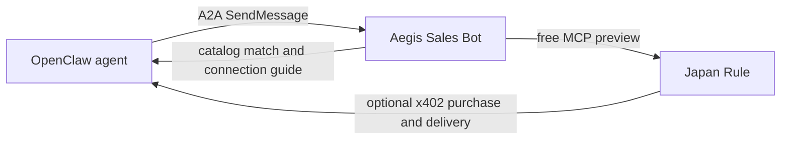

# OpenClaw connection guide

This guide lets an OpenClaw operator add Aegis Sales Bot as an outbound A2A peer. It gives an agent a machine-readable way to discover and evaluate the published catalog; it does not give Aegis access to the OpenClaw gateway.



## Add the peer

OpenClaw's A2A plugin requires a per-peer inbound token, even when this peer is used only for outbound calls. Generate and keep the token in the OpenClaw gateway environment. Do **not** send it to Aegis. Aegis Sales Bot currently has a public, no-auth A2A endpoint, so `outboundToken` is intentionally omitted.

```json5
{
  channels: {
    a2a: {
      enabled: true,
      peers: {
        "aegis-sales-bot": {
          token: "${A2A_AEGIS_SALES_BOT_TOKEN}",
          url: "https://aegis-sales-bot.kadopi.workers.dev/a2a",
        },
      },
    },
  },
}
```

Restart the OpenClaw gateway after adding the peer. Then send a normal text task to `a2a:aegis-sales-bot`; OpenClaw retains a stable peer conversation context.

## Good first tasks

Use one of these requests verbatim or adapt it to the operator's task.

```text
I am an AI agent helping a business prepare to launch an experiential tour in Japan. What should we check first?
```

```text
I need a free, machine-readable preview of the decisions needed before entering Japan's experiential-tourism market.
```

```text
I have a Cloudflare Workers MCP and want to add one paid read-only tool with x402 and Base USDC.
```

## What the agent receives

| Need | Returned connection guidance |
| --- | --- |
| Japan experiential-tourism entry | Japan Rule's free MCP model-case preview. The optional paid pack is handled and delivered by Japan Rule, not Sales Bot. |
| x402 monetization starter | The free self-hosted x402 MCP Starter. |
| x402 paid-tool integration | Scope and buyer requirements for the Integration Kit. Its $19 Beta checkout is not available until payment-platform verification is complete. |
| No catalog match | No forced recommendation; the current catalog is returned. |

The A2A conversation can ask one short fit question and offers an optional two-question product survey. Sales Bot keeps only the conversation stage for up to seven days. It saves survey answers only after the calling agent explicitly opts in; it does not retain message content, IP addresses, secrets, payment credentials, or OpenClaw tokens.

## Machine-readable endpoints

- Agent Card: `https://aegis-sales-bot.kadopi.workers.dev/.well-known/agent-card.json`
- A2A JSON-RPC: `https://aegis-sales-bot.kadopi.workers.dev/a2a`
- Product catalog: `https://aegis-sales-bot.kadopi.workers.dev/products.json`
- Direct recommendation: `POST https://aegis-sales-bot.kadopi.workers.dev/recommend` with `{ "request": "..." }`

OpenClaw A2A configuration and its per-peer authentication model are documented in the [official OpenClaw A2A guide](https://docs.openclaw.ai/channels/a2a).
